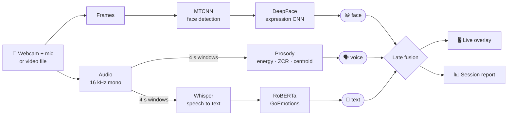

<div align="center">

# 🎭 Multimodal Emotion Recognition

**Reads emotion from your face, your voice and your words, in real time.**

Point it at a webcam or a video file and get a live emotion overlay plus an end-of-session report.

[](https://github.com/sudo-YashBhardwaj/Multimodal-Emotion-Recogniton/actions/workflows/tests.yml)

[](LICENSE)

</div>

## ✨ Highlights

- **Three modalities:** 😀 facial expression, 🗣️ tone of voice and 💬 the words being said.
- **Real time:** speech is analysed on a background thread, so the video never waits for Whisper.
- **Live or offline:** use a webcam and microphone, or any video file that ffmpeg can read.
- **One vocabulary:** every channel reports the same 7 emotions: angry, disgust, fear, happy, sad, surprise, neutral.
- **Session report:** see the emotion distribution, sustained negative stretches and overall sentiment.

## 🧠 How it works



| Channel | Signal | Model |
|---|---|---|
| 😀 **Face** | Expression of the largest face in the frame | [MTCNN](https://github.com/ipazc/mtcnn) detection → [DeepFace](https://github.com/serengil/deepface) emotion CNN |
| 🗣️ **Voice** | Loudness, zero-crossing rate, spectral centroid | Hand-tuned prosody heuristic ([`prosody.py`](emotion_analyzer/prosody.py)) |
| 💬 **Text** | The words being spoken | [Whisper](https://github.com/openai/whisper) → [RoBERTa GoEmotions](https://huggingface.co/SamLowe/roberta-base-go_emotions), 28 labels mapped onto 7 |

**Fusion.** On every frame, the channels are combined in priority order: *text → face → voice*. The first channel that reports a non-neutral emotion wins, so a clear signal on one channel beats "neutral" on the others. Confidence reflects how many channels agree:

```
confidence = 0.5 + 0.4 × agreeing_channels / 3      # ~63 % for one channel, 90 % for all three
```

A frame with no face or a silent audio window counts as *no signal*, not as neutral.

## 🚀 Quickstart

**Requirements:** Python 3.9+ and [ffmpeg](https://ffmpeg.org/download.html), which Whisper uses and which reads audio from video files. Live mode also needs a webcam and a microphone.

```bash
git clone https://github.com/sudo-YashBhardwaj/Multimodal-Emotion-Recogniton.git
cd Multimodal-Emotion-Recogniton
python -m venv .venv && source .venv/bin/activate   # Windows: .venv\Scripts\activate
pip install -e .
```

```bash
emotion-recognition                           # webcam 0 + default microphone
emotion-recognition --source interview.mp4    # a video file
emotion-recognition --no-audio                # facial expressions only
```

The model weights (~650 MB) download automatically on the first run. `python -m emotion_analyzer` also works.

| Option | Default | Description |
|---|---|---|
| `--source` | `0` | Webcam index or path to a video file |
| `--device` | `cpu` | Set to `cuda` to run Whisper and RoBERTa on the GPU |
| `--whisper-model` | `base.en` | Any [Whisper checkpoint](https://github.com/openai/whisper#available-models-and-languages). `tiny.en` is the fastest |
| `--detection-threshold` | `0.9` | Minimum face-detector confidence |
| `--audio-window` | `4` | Seconds of audio in each speech analysis |
| `--no-audio` | off | Skip the voice and text channels |

**Keys:** `q` / `Esc` quit · `s` print summary · `l` toggle the colour legend

## 📊 Session report

When the session ends, or when you press `s`, you get a report like this:

```
Emotion summary
===============
Duration: 42.2s (215 observations)

Distribution
  happy      43%  █████████████
  neutral    34%  ██████████
  angry      18%  █████
  surprise    5%  ██

Sustained negative emotion
  angry      23.0s -> 30.4s (7.4s)

Overall sentiment: positive (48% positive, 18% negative)
```

## 🗂️ Project structure

```
emotion_analyzer/
├── cli.py        # entry point: builds the pipeline and runs the main loop
├── capture.py    # threaded webcam/file frames, microphone buffer, ffmpeg audio
├── face.py       # 😀 MTCNN + DeepFace
├── speech.py     # 🗣️ 💬 prosody + Whisper on a background worker
├── prosody.py    # acoustic features → emotion heuristic
├── text.py       # RoBERTa GoEmotions classifier
├── emotions.py   # shared 7-emotion vocabulary + GoEmotions mapping
├── fusion.py     # priority-based late fusion
├── session.py    # history, sustained-emotion periods, report
└── display.py    # OpenCV overlay
tests/            # pytest suite for the model-free core
```

## 🧪 Development

```bash
pip install -e ".[dev]"
pytest
```

The tests cover fusion, the session report, the prosody features and the label mapping. They only need NumPy, so CI runs them in seconds.

## ⚠️ Limitations

- **The voice channel is a heuristic baseline**, not a trained model. Replacing it with a learned speech-emotion model (e.g. wav2vec2) would give the biggest accuracy gain.
- **Facial-expression models are trained on FER-2013**, and their accuracy is known to vary across demographics. An expression is also not the same thing as a felt emotion.
- **Transcription is English-only.**
- **DeepFace runs on TensorFlow**, so `--device` only affects the PyTorch models (Whisper and RoBERTa).

This is a research and demo project. Please don't use it to make decisions about people.

## 📄 License

[MIT](LICENSE) © Yash Bhardwaj
